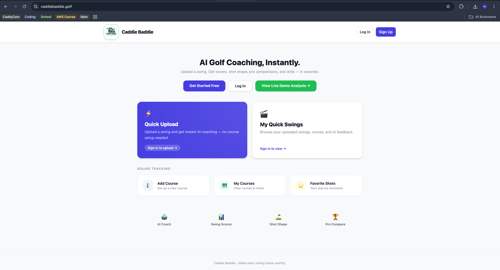
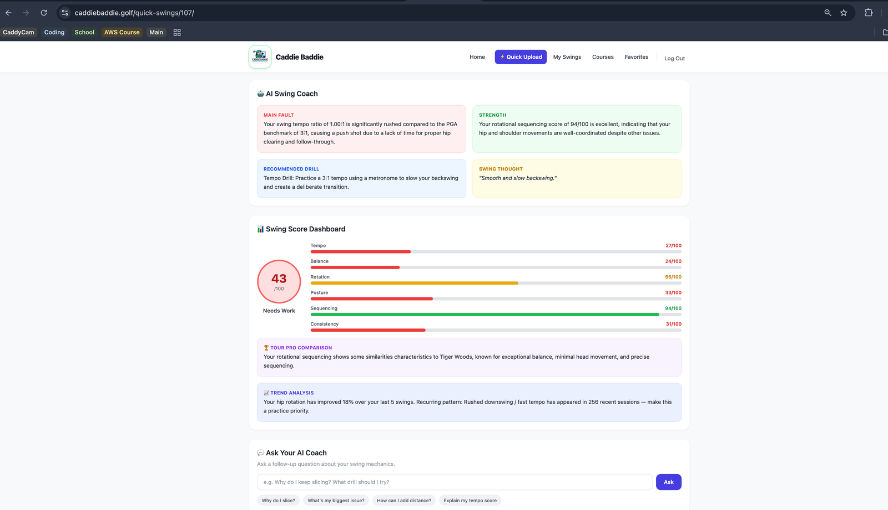
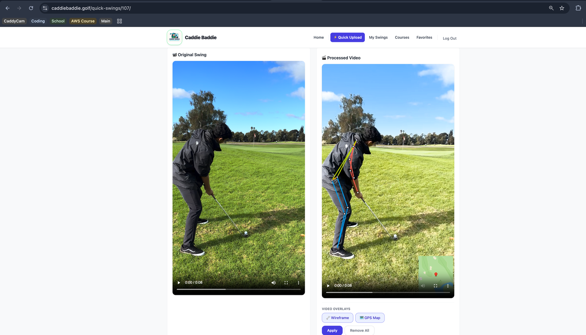

# Caddie Baddie

An AI-powered golf coaching platform — upload a swing and get instant scoring, tour pro comparisons, and personalized coaching feedback. Built solo, full-stack, from data model through video processing pipeline to a deployed live product.



**Live site:** [caddiebaddie.golf](https://caddiebaddie.golf)

## What It Does

Golfers already film their swing on a phone — Caddie Baddie turns that raw video into an actual coaching session. Upload a swing and the app processes the video, scores the swing across six dimensions, compares it to tour pro tendencies, and lets you ask follow-up questions to an AI coach that already has your swing data in context.

- **Instant swing scoring** across Tempo, Balance, Rotation, Posture, Sequencing, and Consistency, with an overall score and a plain-language main fault, strength, and recommended drill
- **Tour pro comparison** — matches swing characteristics against known professional tendencies
- **Trend analysis across sessions** — tracks improvement over time and flags recurring patterns (e.g. a rushed downswing showing up repeatedly across recent swings)
- **Interactive AI coach chat** — ask follow-up questions about your own swing mechanics, with the model already grounded in your actual analysis
- **Automated video processing** — generates a pose-estimation wireframe overlay and a GPS shot-location map directly on the video, side by side with the original
- **Course and round tracking**, separate from the "no setup needed" quick-upload path, for golfers who want to organize swings by course and round rather than just a flat upload history

## AI Swing Coach



Every uploaded swing gets broken into a scored dashboard (Main Fault / Strength / Recommended Drill / Swing Thought, plus six individually-scored metrics), a tour pro comparison, and a trend-analysis card that looks across the user's recent swing history — not just the one just uploaded. The "Ask Your AI Coach" panel lets the user ask a specific question and get an answer grounded in their own data, rather than generic golf advice.

## Video Processing



Every uploaded video is automatically processed into an overlay version, no manual editing required:

- **Pose-estimation wireframe** (shoulder, spine, hip, and leg alignment lines), generated via MediaPipe
- **GPS shot-location map**, extracted from the video's embedded location metadata (Apple QuickTime ISO6709 tags) and rendered via the Mapbox Static Images API — falls back to a static map if GPS metadata isn't available
- Both overlays are toggleable independently

**Supported formats:** MOV (iPhone default), MP4, and anything else `ffmpeg` supports.

## Tech Stack

- **Backend:** Python, Django, Django REST Framework
- **Database:** PostgreSQL
- **Video processing:** FFmpeg, OpenCV, MediaPipe (pose estimation)
- **AI/ML:** OpenAI API (swing analysis, coaching feedback, and the interactive chat coach)
- **Maps:** Mapbox Static Images API (GPS shot-location overlays)
- **Cloud infrastructure:** AWS S3 (storage), AWS SES (email)
- **Frontend:** Tailwind CSS
- **Deployment:** Render
- **Version control:** Git

## Engineering Notes

- **The video processing pipeline is the hard part of this app**, not the CRUD around it — reliably generating pose-estimation overlays across inconsistent phone-recorded video (different resolutions, orientations, frame rates) required real debugging and defensive handling, not just calling a library function once.
- **The AI coach is grounded in real swing data, not a generic chatbot** — swing scores, detected faults, and session history all feed into the context the model uses to answer follow-up questions, so answers are specific to that user's actual swing rather than generic golf tips.
- **Trend analysis works across sessions, not just the current upload** — the app tracks a user's swing history over time to detect recurring patterns (e.g. the same tempo issue appearing repeatedly), which requires real historical data modeling, not just per-video analysis.
- **Deployed and operated as a real, live product** (not just a local demo) — includes authentication, access control, and a processing pipeline designed so uploads don't block the user while video processing happens.

---

## Local Development Setup

### 1. Create and activate a virtualenv (optional but recommended)

```bash
python3 -m venv .venv
source .venv/bin/activate
```

### 2. Install requirements

```bash
pip install -r requirements.txt
```

### 3. Run migrations

```bash
python manage.py migrate
```

### 4. Start the server

**Option A: Simple start (computer only)**
```bash
python manage.py runserver
```
Then open http://127.0.0.1:8000/

**Option B: Mobile access (iPhone/iPad)** ⭐ Recommended for testing uploads from a phone
```bash
python start_mobile.py
```
This displays your local network URL, e.g. `http://192.168.1.100:8000/`

**Option C: Manual start with mobile access**
```bash
python manage.py runserver 0.0.0.0:8000
```

### Accessing from Your iPhone

Your iPhone and Mac must be on the same Wi-Fi network.

1. Start the server with `python start_mobile.py`
2. Note the Local Network URL it displays
3. Open Safari on your iPhone and enter that URL
4. Upload videos directly from your iPhone camera roll

**Can't connect from iPhone?**
- Check both devices are on the same Wi-Fi network
- Make sure your Mac's firewall allows incoming connections
- Try turning off VPN if you're using one
- Verify the IP address hasn't changed (re-run the script)

### Remote/Secure Access (Optional)

For accessing from outside your local network or for HTTPS:

**ngrok:**
```bash
brew install ngrok
python manage.py runserver
# in another terminal:
ngrok http 8000
```

**Cloudflare Tunnel:**
```bash
brew install cloudflare/cloudflare/cloudflared
python manage.py runserver
cloudflared tunnel --url http://localhost:8000
```

## Configuration

**Mapbox API Token** — set in `golf_caddie/settings.py`, or as an environment variable:
```bash
export MAPBOX_TOKEN='your-token-here'
```

**Map overlay size** — adjustable in `utils/overlay.py`:
```python
overlay_w = max(64, int(vwidth * 0.30))  # 30% of video width
```

## Database

The app uses **PostgreSQL**. Local setup depends on your own Postgres installation/configuration — set your connection details in `golf_caddie/settings.py` (or via environment variables, depending on your local config), then run migrations as above.

## Admin Access

```bash
python manage.py createsuperuser
```
Then visit `/admin/`.

## macOS System Requirements (ffmpeg)

Video processing requires `ffmpeg` and `ffprobe`.

```zsh
# Install Homebrew if needed
/bin/bash -c "$(curl -fsSL https://raw.githubusercontent.com/Homebrew/install/HEAD/install.sh)"

# Install ffmpeg (includes ffprobe)
brew install ffmpeg

# Verify
which ffprobe && which ffmpeg
```

## Troubleshooting

- **"Processing Failed" on the Analyze page:** confirm `ffmpeg`/`ffprobe` are installed and on your PATH (`which ffprobe`), then check the most recent log under `media/logs/overlay_*.log` for the exact error.
- **Missing GPS overlay:** the app falls back to a static map if the video has no embedded GPS metadata — this is expected behavior, not a bug.

## Repository

[github.com/marcusduggs/Caddie_Baddie](https://github.com/marcusduggs/Caddie_Baddie)

## License

This project is for personal use.
